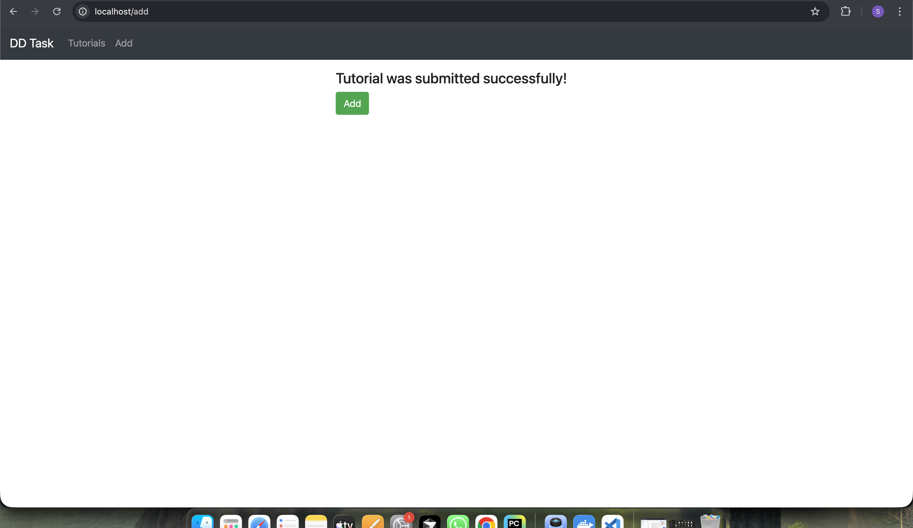

In this DevOps task, you need to build and deploy a full-stack CRUD application using the MEAN stack (MongoDB, Express, Angular 15, and Node.js). The backend will be developed with Node.js and Express to provide REST APIs, connecting to a MongoDB database. The frontend will be an Angular application utilizing HTTPClient for communication.  

The application will manage a collection of tutorials, where each tutorial includes an ID, title, description, and published status. Users will be able to create, retrieve, update, and delete tutorials. Additionally, a search box will allow users to find tutorials by title.

# CRUD DD Task – MEAN Stack App (MongoDB + Express + Angular 15 + Node.js)

This repo contains a full-stack CRUD application for managing **Tutorials** (title, description, published).
The application is containerized using Docker and runs behind **Nginx reverse proxy on port 80**.
A GitHub Actions CI pipeline builds & pushes Docker images to Docker Hub on every push to `main`.

---

## Features
- Create / Read / Update / Delete tutorials
- Search tutorials by title
- MongoDB persistence
- Nginx reverse proxy (single entrypoint on port 80)

---

## Tech Stack
- Frontend: Angular 15
- Backend: Node.js + Express (REST API)
- Database: MongoDB
- Reverse Proxy: Nginx
- CI/CD: GitHub Actions → Docker Hub

---

## Architecture
Services (Docker Compose):
- `mongo` (MongoDB)
- `backend` (Node/Express API)
- `frontend` (Angular build served in container)
- `nginx` (reverse proxy, exposed on port 80)

Routing:
- UI: `http://localhost/`
- API (via proxy): `http://localhost/api/tutorials`

---

## Prerequisites
- Docker + Docker Compose installed

---

## Run Locally (Docker Compose)

### 1) Clone
git clone https://github.com/shriyashaThakur/crud-dd-task-mean-app.git
cd crud-dd-task-mean-app 

---
### Build & start
docker compose up -d --build

### Verify containers
docker ps

### Test API via Nginx reverse proxy
curl -i http://localhost/api/tutorials

### Open UI
(http://localhost/)

### Stop
docker compose down

Screenshots proof:
### App UI – Tutorials list

### App UI – Add tutorial

---
### Docker Hub Images
Published Docker images:

- shriyasha/mean-backend
- shriyasha/mean-frontend
- shriyasha/mean-nginx
- Screenshot proof:
  
### Docker Hub – Repositories

---
### CI/CD (GitHub Actions)
On every push to main, GitHub Actions workflow:

- builds Docker images (backend, frontend, nginx)
- logs in to Docker Hub
- pushes images to Docker Hub

GitHub Secrets used
Add these in:
Repo → Settings → Secrets and variables → Actions

- DOCKERHUB_USERNAME = shriyasha
- DOCKERHUB_TOKEN = Docker Hub Access Token (Read & Write)

Screenshots proof:
### GitHub Actions – Workflows page

### GitHub Actions – Successful run (summary)

### GitHub Actions – Successful run (Build/Push steps)
.png)
